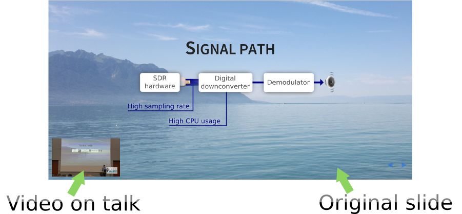

# RevealTalkVideo

This plugin is for embedding the YouTube video of your talk into a Reveal.js presentation. It is for publishing the presentation to the web after actually giving the talk.

The video of your talk will play in the corner of the presentation:



Using pre-recorded keyframes, the presentation and the video will be synchronized: moving around in the video will change slides, and moving around in the slides will seek in the video.

To insert RevealTalkVideo into your Reveal.js presentation:

```bash
cd plugin
git clone https://github.com/ha7ilm/RevealTalkVideo talkvideo
cd ..
```

Now open your HTML file, and make your Reveal.js initialization look like this:

```html
<script src="js/reveal.js"></script>
<script>

var slideTimeMap =
[];

    Reveal.initialize({
        //(...)

        talkVideo:
        {
            animateOnStart: true,
            slideTimeMap: slideTimeMap,
            youtubeVideoId: 'fgFto-Oj-uw', // <--- replace with own video ID
            playerWidth: 300,
            playerHeight: 168,
            playerAutoStart: true,
            playerAutoStartOnlyOnFirstSlide: true
        },

        // Optional reveal.js plugins
        dependencies: [
            //(...)
            { src: 'plugin/talkvideo/talkvideo.js' }
        ]
    })
</script>
```

...and add this code to the end of your HTML:
```html
<style>
.reveal-talkvideo iframe {
    position: fixed;
    left: 15px;
    bottom: 15px;
}
</style>
<div class="reveal-talkvideo">
    <div id="reveal-talkvideo-player"></div>
</div>
```

Now open the presentation in the browser.

Also open the browser console (<kbd>Ctrl</kbd>+<kbd>Shift</kbd>+<kbd>J</kbd> in Google Chrome).

Start playing the video of the talk.

As the video advances and the slides are changed in it, press the <kbd>R</kbd> button to record this event. This will also change the slides in the current Reveal slideshow.

Don't worry, you can undo the last recorded move by pressing <kbd>U</kbd>.

At the end, enter this into the browser console:

```js
RevealTalkVideo.printNewSlideTimeMap()
```

You should get something like this:

```js
slideTimeMap = [
	{ time: 217.14, slide: [ 15, 0, -1] },
	{ time: 224.74, slide: [ 16, 0, -1] },
	{ time: 237.80, slide: [ 17, 0, -1] },
	{ time: 243.85, slide: [ 18, 0, -1] },
	{ time: 399.43, slide: [ 27, 0, -1] },
	{ time: 407.81, slide: [ 28, 0, -1] },
	{ time: 422.42, slide: [ 29, 0, -1] },
];
```
The descriptor of the keyframes look like this:
* `time` is the time of the keyframe in the video, in seconds.
* `slide` is the set of parameters for slide change that happens when the video approaches `time`. These parameters are given to `Reveal.slide(indexh, indexv, indexf)` (horizontal, vertical and fragment index).

Replace `slideTimeMap` in your HTML code with this new one.

From now on the Reveal.js presentation and the video of your talk will be in sync.

> On mobile devices, the YouTube video will be hidden.
